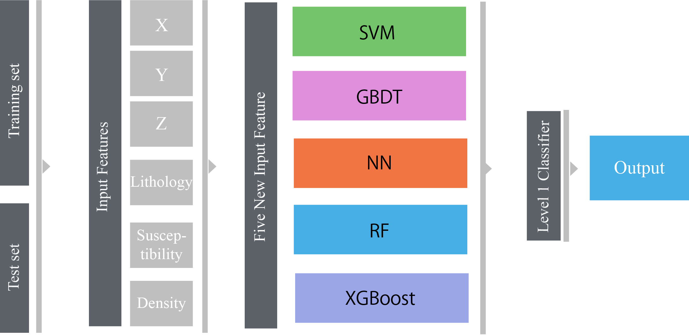
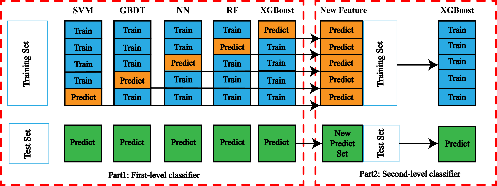
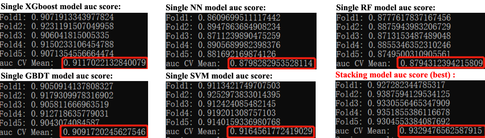

GeoStack
====

## Introduction

We can use models of scikit-learn, XGboost, and Keras for stacking. As a feature of our project, all out-of-fold predictions can be saved for further analisys after training.
[Stacking](https://en.wikipedia.org/wiki/Ensemble_learning#Stacking) (stacked generalization) involves training a learning algorithm to combine the predictions of several other learning algorithms. Stacking yields typically better performance than any single trained models. It has been used successfully in regression and classification (Breiman, 1996).The basic idea is to use a pool of base classifiers, then using another classifier to combine their predictions, with the aim of reducing the generalization error. 

## Requirements

- Numpy
- Pandas
- XGboost
- Scikit-learn
- Tensorflow2.0 or later

## Usage

To train and predict the GeoStack model, just run `python main.py`. Note that: 

1. Set train and predict dataset under data/input

2. Stacking features from original dataset need to be under data/output/stacking_features

3. Final preidction result in `final_results.csv` is under output folder

4. We can visulize the prediction results in `GoCAD`softwares


### Detailed Usage

1. Set train dataset with its target data and test dataset.

    ```python
    FILES_LIST_stage1 = {
                    'train':(
                             INPUT_PATH + 'train.csv',
                            ),
    
                    'target':(
                             INPUT_PATH + 'target.csv',
                            ),
    
                    'test':(
                             INPUT_PATH + 'test.csv',
                            ),
                    }
    ```
2. We define model classes that inherit `BaseModel` class, which are used in Stage 1, Stage 2. In our project, we use `xgboost`, `randomforest`, `svm`, and `gbdt` as stage 1 models. In stage2, we use `xgboost` again as final model to predict the final results.

    The models usage and params are as follows:
    
    ```python
    # Model usage
    class xgb_stage1(BaseModel):
        def build_model(self):
            return Xgb(**self.params)
    ```
    ```python
    # For Stage 1
    XGB_PARAMS = {
            'colsample_bytree':0.80,
            'learning_rate':0.1,"eval_metric":"auc",
            'max_depth':5, 'min_child_weight':1,
            'nthread':4,
            'objective':'binary:logistic','seed':407,
            'silent':1, 'subsample':0.60,
            }
    
    NN_PARAMS = {
            'batch_size':32,'epoch':100,
            'verbose':1, 'callbacks':[],
            'shuffle':True,
            'class_weight':None,
            'sample_weight':None,
            'normalize':True,
            'categorize_y':True
            }

    RF_PARAMS = {
             'n_estimators':500, 'criterion':'gini', 
             'n_jobs':8, 'verbose':0,
             'random_state':407, 'oob_score':True,
             }

    GBDT_PARAMS = {
             'n_estimators':300, 'learning_rate':0.05,
             'subsample':0.8,
             'max_depth':5, 'verbose':1, 
             'max_features':0.9,
             'random_state':407,
             }

    SVM_PARAMS = {
             'kernel':'rbf',
             'C': 100,
             'gamma': 11,
             'probability': True
             }

    # For Stage 2
    XGB_PARAMS_stage2 = {
            'colsample_bytree':0.8, 'learning_rate':0.1,
            "eval_metric":"mlogloss", 'max_depth':4, 
            'seed':1234, 'nthread':8,
            'reg_lambda':0.01, 'reg_alpha':0.01,
            'subsample':0.80,
            'objective':'multi:softprob',
            'num_class':output_dim,
            }
    
    ```
    
3. Train each models of Stage 1 for stacking.

    ```python
    m = Model_XGB(name="xgb_stage1",
                flist=FILES_LIST_stage1,
                params = XGB_PARAMS,
                )
    m.run()
    
    ...
    ```

4. Train each model of Stage 2 by using the prediction of Stage-1 models.

    ```python
    FILES_LIST_stage2 = {
                'train':(
                        INPUT_PATH + 'train.csv',
                         FEATURE_PATH + 'xgb_stage1_all_fold.csv',
                         FEATURE_PATH + 'nn_stage1_all_fold.csv',
                         FEATURE_PATH + 'rf_stage1_all_fold.csv',
                         FEATURE_PATH + 'gbdt_stage1_all_fold.csv',
                         FEATURE_PATH + 'svm_stage1_all_fold.csv',
                        ),

                'target':(
                         INPUT_PATH + 'target.csv',
                        ),

                'test':(
                         INPUT_PATH + 'test.csv',
                         FEATURE_PATH + 'xgb_stage1_test.csv',
                         FEATURE_PATH + 'nn_stage1_test.csv',
                         FEATURE_PATH + 'rf_stage1_test.csv',
                         FEATURE_PATH + 'gbdt_stage1_test.csv',
                         FEATURE_PATH + 'svm_stage1_test.csv',
                                                
                        ),
                }

    m = XGB_stage2(name="xgb_stage2",
                    flist=FILES_LIST_stage2,
                    params = XGB_PARAMS_stage2,
                    )
    m.run()
    ```

5. Final result is saved as `xgb_stage2_test.csv`.


## Scripts
- `data/input`: original train and pred dataset
- `data/output/stacking_features`: stage 1 features
- `stacking/base.py`: stacking module
- `main.py`: train and predict program


## Detailed scrips

- `base.py`: 
  - Base models for stacking are defined here (using sklearn.base.BaseEstimator).
  - Some models are defined here. e.g., XGBoost, Keras, Vowpal Wabbit.
  - These models are wrapped as scikit-learn like (using sklearn.base.ClassifierMixin, sklearn.base.RegressorMixin).
  - That is, model class has some methods, fit(), predict_proba(), and predict().


## Stacking Framework 
- The stacking framework of our research  



## Stacking model training strategy
- The training strategy of our research  



## Performance of stacking model
- We use AUC score and roc to evaluate the models and compare the performance of stacking model with single model.



- ***From the model evaluation results, the auc score of the stacking model is `0.93`. Compared with a single model, it achieves better generalization performance.***

## LICENSE
GPL3.0

## How to contact us?
-  gwwang@cugb.edu.cn  

-  lvyikai2012@gmail.com


-  2101180102@cugb.edu.cn